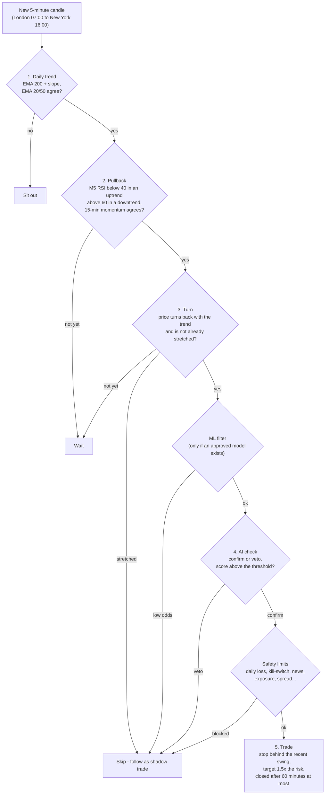
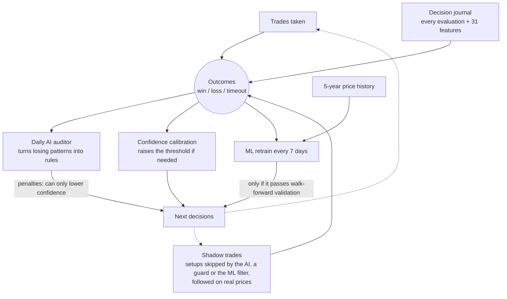
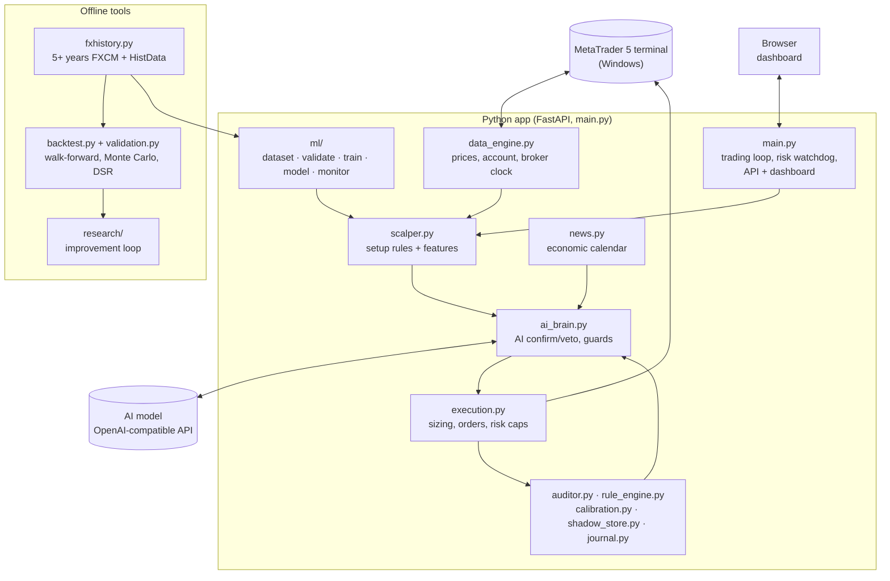
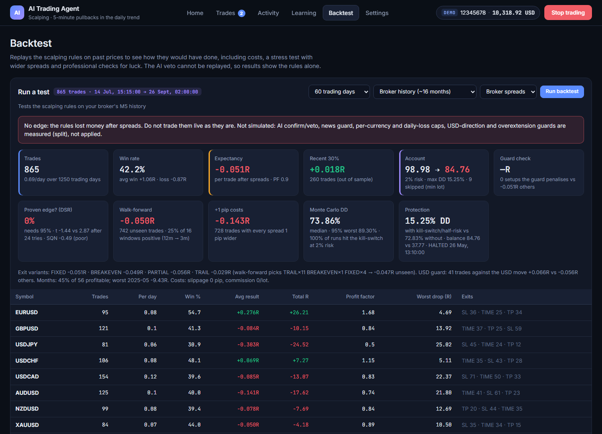

# AI Trading Agent for MetaTrader 5

An autonomous forex and gold trading agent for **MetaTrader 5**. Fixed rules find the setups, an **AI model
confirms or vetoes** each one, **strict risk limits** protect the account, and the agent **learns from every
trade and every trade it skipped**. It comes with a web dashboard, a professional backtester and a
machine-learning filter that only switches on once it has proven itself.


> [!WARNING]
> **This is a research project, not a money machine.** Over 5 years of history the current scalping
> rules **lose money** (see [Results so far](#results-so-far)). Run it on a **demo account**. Trading
> carries a real risk of loss, and nothing here is financial advice.

---

## Contents

- [What it does](#what-it-does)
- [How a trade is decided](#how-a-trade-is-decided)
- [How it protects the account](#how-it-protects-the-account)
- [How it learns](#how-it-learns)
- [Architecture](#architecture)
- [The dashboard](#the-dashboard)
- [Getting started](#getting-started)
- [Backtesting, ML and research](#backtesting-ml-and-research)
- [Configuration](#configuration)
- [Results so far](#results-so-far)
- [Running 24/7](#running-247)
- [Project structure](#project-structure)
- [Tests](#tests)
- [Security notes](#security-notes)

---

## What it does

| | |
|---|---|
| **Trades** | EURUSD, GBPUSD, USDJPY, USDCHF, USDCAD, AUDUSD, NZDUSD and gold (XAUUSD), or any symbols your broker offers |
| **Strategy** | *Scalping* (default): 5-minute pullbacks in the direction of the daily trend, during London and New York hours. *Swing*: the AI rates every pair once an hour |
| **AI** | Any OpenAI-compatible chat model (DeepSeek by default; NVIDIA NIM and others work) reviews each setup with the wider market picture |
| **Risk** | Position sizing by % of equity, a daily loss limit, a drawdown kill-switch, news and weekend filters, per-currency exposure caps, and more |
| **Learning** | A daily AI auditor turns losing patterns into rules; skipped setups are tracked as *shadow trades*; an ML model is retrained weekly |
| **Testing** | Backtests on 5+ years of bid/ask history with walk-forward, Monte Carlo and statistical checks for luck |
| **Dashboard** | Plain-language status, a live market watch, trade history, settings with presets and a setup guide |

---

## How a trade is decided

Every closed 5-minute candle, each pair has to pass five steps. Most of the time a pair stops at step 1
or 2, so **quiet periods are normal**.



The dashboard's **Market watch** (in the screenshot at the top) shows exactly where each pair is in this
flow, with one dot per step and a sentence saying what it is waiting for.

---

## How it protects the account

Protection is enforced by code. The AI can only make the bot **more** careful, never riskier.

| Protection | What it does | Default |
|---|---|---|
| Risk per trade | Lot size so a stop-loss costs this % of equity | 1% |
| Daily loss limit | No new trades until 17:00 New York after losing this much today; can close the bot's trades | 5% |
| Account protection | Half risk after falling from the equity peak, full stop further down (manual reset) | −5% / −10% |
| Open risk budget | Refuses a trade if every open stop plus the new one could pass the daily limit | on |
| Currency exposure | Caps the combined risk on one currency direction (e.g. long USD) | 2.5% |
| News guard | No entries 30 min before to 15 min after high-impact news | on |
| Weekend guard | No entries near the Friday close; can also close the bot's trades before the weekend | entry pause on, auto-close off |
| Stretched-price guard | Skips setups far from their average or with extreme RSI | on |
| Loss cooldown | No re-entry in the same direction on a pair after a loss | 120 min |
| Spread and drift checks | Refuses orders when the spread is too wide or price moved while the AI was thinking | on |
| Duplicate and reversal guards | One position per pair and direction; flips need extra confidence | on |

All limits survive restarts (they are saved to `risk_state.json`).

---

## How it learns



- **Shadow trades** answer "was skipping that setup right?". They count at half weight in every learning step.
- **The ML filter** (LightGBM or a logistic model) predicts each setup's chance of winning. It is used
  **only** if it beats "no model" on data it never saw, with 1 pip of extra cost, and passes a
  multiple-testing check. If its live results drift below its predictions, it pauses itself.

---

## Architecture



---

## The dashboard

Open `http://127.0.0.1:8000` once the bot is running. Six pages:

| Page | What you see |
|---|---|
| **Home** | Is it running, what it is doing, today's result, Market watch, safety summary, open trades |
| **Trades** | Open positions (with close buttons) and the full trade history with filters and CSV export |
| **Activity** | The latest decision in detail, the latest fill, and a live log with filters |
| **Learning** | Learned rules, the AI-veto check, the ML filter (with a *Train now* button), shadow trades |
| **Backtest** | Run backtests on broker history or the 5-year history |
| **Settings** | Pairs, risk presets, daily limits, account protection, trading hours, safety filters |

**First-run setup guide:** connection check → risk style → pairs → review and start.


**Settings** with one-click risk styles that show the money at risk for your balance:


<details>
<summary><b>More screenshots</b> (Activity, Trades, Backtest, Learning)</summary>





</details>

*Screenshots use demo data.*

---

## Getting started

### Requirements

- **Windows** (the MetaTrader 5 Python package only works on Windows)
- **MetaTrader 5** installed and logged in to your broker account (use a **demo** account first)
- **Python 3.12 or 3.13**
- An **API key** for an OpenAI-compatible chat model (for example DeepSeek)

### Install

```powershell
git clone <your-repo-url>
cd <repo-folder>
py -3.13 -m venv .venv
.venv\Scripts\python.exe -m pip install -r requirements.txt
copy .env.example .env
```

Edit `.env` and fill in at least:

```ini
DEEPSEEK_API_KEY=your_api_key
DEEPSEEK_API_BASE=https://api.deepseek.com
DEEPSEEK_MODEL=deepseek-chat
MT5_LOGIN=your_account_number
MT5_PASSWORD=your_password
MT5_SERVER=YourBroker-Demo
```

In MetaTrader 5, enable **Tools → Options → Expert Advisors → Allow algorithmic trading**.

### Run

```powershell
start_background.bat      # starts the bot in the background (restarts itself if it crashes)
stop_background.bat       # stops it
```

Then open **http://127.0.0.1:8000**. The setup guide opens on the first visit. Press **Start trading**
when you are ready. The output goes to `server.log`.

---

## Backtesting, ML and research

```powershell
# 1. Download 5.5 years of M1 history for the 8 pairs (~20 minutes the first time, seconds after)
.venv\Scripts\python.exe fxhistory.py all --years 5.5

# 2. Backtest the rules on it (also available on the dashboard's Backtest page)
.venv\Scripts\python.exe backtest.py --source history --days 1250
.venv\Scripts\python.exe backtest.py --source history --days 1250 --extra-spread 1 --slippage 0.5

# 3. Train and validate the ML filter (also runs automatically every 7 days)
.venv\Scripts\python.exe -m ml.train

# 4. Try strategy ideas the disciplined way (see research/program.md)
.venv\Scripts\python.exe research\evaluate.py
```

**History sources:** the free [FXCM candle archive](https://candledata.fxcorporate.com) (weekly M1
bid + ask, so real spreads) for the 7 FX pairs, and [HistData.com](https://www.histdata.com) for gold
and for any days FXCM is missing. Bars are rebuilt on the broker's clock, and were checked against real
MT5 bars (EURUSD within 0.1 pip).

**Every backtest report includes:**

- walk-forward results on data the rules were not tuned on;
- a +1 pip cost stress test;
- Monte Carlo drawdown ranges;
- month-by-month stability;
- the **Deflated Sharpe Ratio**, which asks whether the edge is real or luck, given how many ideas were tried;
- four exit variants (fixed, breakeven, partial, trailing).

---

## Configuration

Everything lives in `.env` (see [`.env.example`](.env.example) for all options with explanations). Most
options can also be changed live on the **Settings** page; those choices are saved in `settings.json` and
override `.env` until you press *Reset to .env*.

| Setting | Meaning | Default |
|---|---|---|
| `STRATEGY_MODE` | `SCALP` or `SWING` | `SCALP` |
| `DEFAULT_RISK_PERCENT` | Risk per trade, % of equity | `1.0` |
| `MAX_DAILY_LOSS_PERCENT` | Daily loss limit | `5.0` |
| `MAX_TOTAL_DRAWDOWN_PERCENT` / `DRAWDOWN_THROTTLE_PERCENT` | Kill-switch / half-risk level from the equity peak | `10` / `5` |
| `SCALP_SESSION_START_LONDON` / `SCALP_SESSION_END_NEW_YORK` | Trading hours (London and New York local time) | `7` / `16` |
| `SCALP_TIME_STOP_MINUTES` | Close a scalp after this long | `60` |
| `CONFIDENCE_THRESHOLD` | AI score needed to trade | `65` |
| `SYMBOLS_DEMO` / `SYMBOLS_LIVE` | Pairs for demo and live accounts | 8 majors + gold |
| `NEWS_GUARD` | Avoid high-impact news | `true` |
| `ML_FILTER` | Use an approved ML model | `false` |
| `ML_AUTO_RETRAIN_DAYS` | Retrain the ML model every N days (0 = off) | `7` |
| `AUTO_START_ENGINE` | Start trading automatically when the server starts | `false` |
| `HOST` / `PORT` | Dashboard address | `127.0.0.1` / `8000` |

---

## Results so far

Honest numbers, so nobody is misled. R = one unit of risk: +1R is a win the size of the stop, −1R a full
loss.

| Test | Trades | Avg result per trade | Verdict |
|---|---|---|---|
| Broker history, 150 days (the period the filters were tuned on) | 107 | +0.28R | Looked good |
| Broker history, 330 days | 194 | +0.09R | Not statistically proven |
| **5-year history (Jul 2021 – Sep 2026)** | **865** | **−0.05R** (−0.14R with +1 pip) | **No edge** |
| ML filter on 1,537 setups | – | no skill (AUC ≈ 0.5) | Not approved |

Net result by year on the 5-year test: 2021 −1.5R · 2022 −9.7R · 2023 −0.6R · 2024 −34R · 2025 −15.8R ·
2026 +17.9R.

**What this means:** the recent good results came from one favourable period. The infrastructure (data,
risk controls, learning, validation) is in place; the **strategy itself still needs to be improved** before
real money. The research loop in `research/` is the tool for that.

---

## Running 24/7

The bot needs a **Windows machine that stays on** with MetaTrader 5 running. Serverless hosts such as
Vercel cannot run it: there is no MT5 terminal, no always-on process and no persistent files.

- **Windows VPS or your own Windows PC / server.** Install MT5 with auto-login and set
  `AUTO_START_ENGINE=true`. Add `start_background.bat` to Task Scheduler "at log on", and disable sleep.
  Risk limits and the equity peak survive restarts.
- **Linux server:** run a Windows virtual machine; MT5 under Wine is not reliable enough for real money.
- Run **only one copy per MT5 account**, or it may trade twice.

---

## Project structure

```
├── main.py              # FastAPI app: trading loop, risk watchdog, learning cycle, API, dashboard
├── scalper.py           # scalping rules (trend, pullback, turn, guards) and ML features
├── ai_brain.py          # AI prompts, confirm/veto, protective guards, learned-rule penalties
├── execution.py         # position sizing, order sending, open-risk and currency caps
├── data_engine.py       # MT5 connection, prices, account, broker clock
├── news.py              # high-impact economic calendar
├── auditor.py           # daily AI auditor that writes rules from losing trades
├── rule_engine.py       # checks learned rules in code
├── calibration.py       # confidence-threshold calibration
├── shadow_store.py      # shadow trades (skipped setups followed on real prices)
├── journal.py           # decision journal (every evaluation, JSONL per day)
├── memory_store.py      # trade memory (memory.json) and reconciliation
├── settings_store.py    # settings saved from the dashboard
├── config.py            # all settings, read from .env
├── backtest.py          # backtester (same rules and costs as live)
├── validation.py        # walk-forward, Monte Carlo, Deflated Sharpe Ratio
├── fxhistory.py         # 5+ years of M1 history (FXCM + HistData)
├── ml/                  # ML filter: dataset, validation, training, live model, drift/retrain monitor
├── research/            # disciplined improvement loop (program.md explains it)
├── templates/index.html # the dashboard
├── tests/               # 15 test suites (python run_tests.py)
├── docs/                # improvement plan and README images
├── start_background.bat / stop_background.bat / run_server.bat
├── requirements.txt
└── .env.example         # every setting with an explanation
```

Runtime files (`.env`, `memory.json`, `settings.json`, `risk_state.json`, `shadow_trades.json`, `data/`,
`backtests/`, `server.log`) are **git-ignored**.

---

## Tests

```powershell
.venv\Scripts\python.exe run_tests.py            # all 15 suites
.venv\Scripts\python.exe run_tests.py scalper    # only suites matching a name
```

The tests use stubbed MT5 and AI connections and temporary folders, so they never place orders or touch
your real data.

---

## Security notes

- **Never commit `.env`.** It holds your API key and MT5 password (it is git-ignored).
- The dashboard has **no login** and can place and close trades. Keep `HOST=127.0.0.1`. To reach it from
  another device, use Remote Desktop or a private network such as Tailscale, not port forwarding.
- Start on a **demo account**. Move to live only after long, positive demo results.

---

*Built as an experiment in combining rule-based trading, AI review, risk management and honest
statistical validation.*
