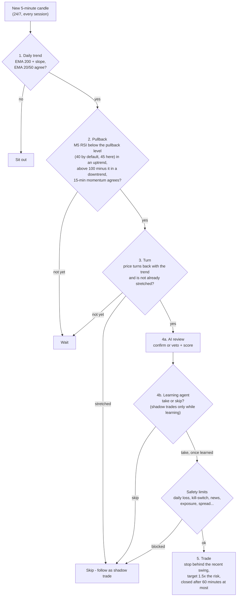
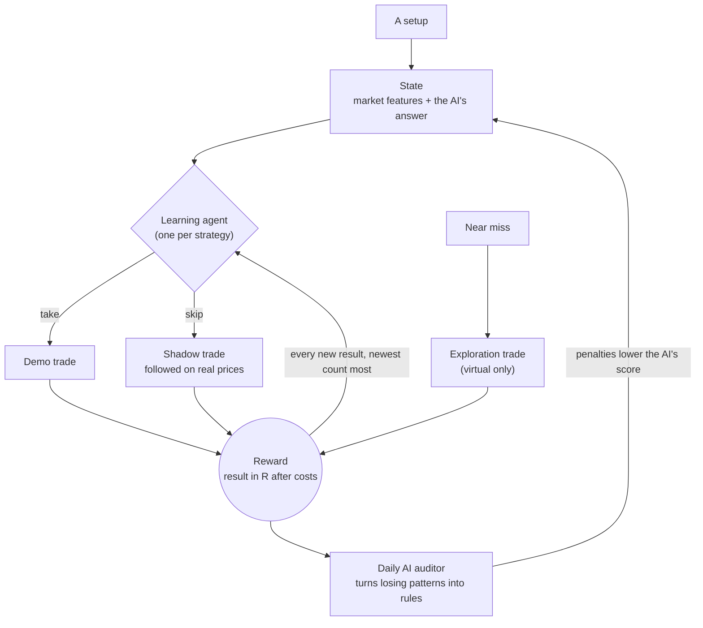
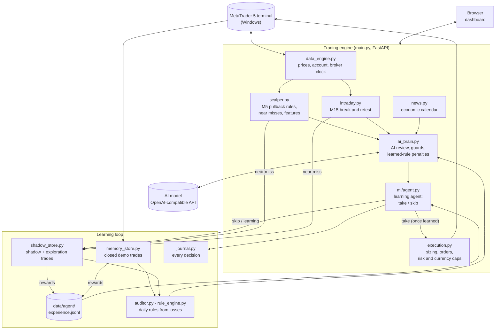

# AI Trading Agent for MetaTrader 5

An autonomous forex and gold trading agent for **MetaTrader 5**. Two rules strategies (scalping and intraday)
look for setups **24/7, in every session, on 26 pairs**; an **AI model** reviews each one, and a
**reinforcement-learning agent** decides take or skip from the **rewards and penalties** it collects on
*shadow trades* (setups followed on real prices without an order) and, once it has learned, on demo trades.
No old price history: it learns from the current market. **Strict risk limits** protect the account, and a
web dashboard shows everything, including a live scorecard.


> [!WARNING]
> **This is a research project, not a money machine.** Earlier 5-year tests of both rules strategies **lost
> money** (see [Results so far](#results-so-far)); the learning agent starts from zero and needs weeks of demo
> trading before its choices mean anything. Run it on a **demo account**. Trading carries a real risk of loss,
> and nothing here is financial advice.

---

## Contents

- [What it does](#what-it-does)
- [How a trade is decided](#how-a-trade-is-decided)
- [Sessions and pairs](#sessions-and-pairs)
- [How it protects the account](#how-it-protects-the-account)
- [How it learns](#how-it-learns)
- [Architecture](#architecture)
- [The dashboard](#the-dashboard)
- [Getting started](#getting-started)
- [Configuration](#configuration)
- [Results so far](#results-so-far)
- [Keeping it running](#keeping-it-running)
- [Project structure](#project-structure)
- [Tests](#tests)
- [Security notes](#security-notes)

---

## What it does

| | |
|---|---|
| **Trades** | 26 pairs: the USD majors, gold (XAUUSD) and 18 crosses (JPY, AUD, EUR, GBP, CAD), or any symbols your broker offers |
| **Strategy** | Two rules strategies that can run **at the same time**: *Scalping* (5-minute pullbacks in the direction of the daily trend) and *Intraday* (15-minute break and retest of yesterday's high/low and the Asian range), **24/7** in every session on all your pairs. *Swing*: the AI rates every pair once an hour |
| **AI** | Any OpenAI-compatible chat model (DeepSeek by default; NVIDIA NIM and others work) reviews each setup with the wider market picture |
| **Risk** | Position sizing by % of equity, a daily loss limit, a drawdown kill-switch, news and weekend filters, per-currency exposure caps, and more |
| **Learning** | A reinforcement-learning agent per strategy learns take/skip from rewards (R) of shadow trades, exploration trades and demo trades; real demo orders start only once it has learned. A daily AI auditor turns losing patterns into rules |
| **Scorecard** | Rewards and penalties per strategy: real trades, skipped setups, "take every setup", AI yes vs no, exploration |
| **Dashboard** | Plain-language status, a live market watch, trade history, settings with presets and a setup guide |

---

## How a trade is decided

Every closed 5-minute candle, each pair has to pass five steps. Most of the time a pair stops at step 1
or 2, so **quiet periods are normal**.



The dashboard's **Market watch** (in the screenshot at the top) shows exactly where each pair is in this
flow, with one dot per step and a sentence saying what it is waiting for. When no real setup forms but one
almost did (a *near miss*: the dip stopped a few RSI points short, or 15-minute momentum had not turned
yet), it is followed as a **virtual exploration trade**: never a real order and no AI call, just one more
reward for the agent to learn from.

### The intraday strategy (runs alongside, on 15-minute candles)

1. **Levels:** yesterday's high and low, and the high and low of the Asian session.
2. **Break:** a 15-minute candle closes through a level, at any hour (the Asian range only after the London open,
   once it is complete).
3. **Retest:** price comes back to touch the level within 8 candles. If it closes more than 0.25 ATR back
   through the level, the break has failed.
4. **Entry:** a candle closes back in the break direction. The stop goes behind the retest swing and the
   target is 2× the risk. The trade closes after 6 hours at most.
5. Its own learning agent, a separate AI reviewer prompt and the same safety limits apply.

The two strategies trade **independently**: each holds at most **one trade per pair**, and a scalp can be
long while an intraday trade on the same pair is short (this needs a *hedging* MT5 account, the usual kind for
demo and retail accounts; on a netting account the opposite trade is refused). Each strategy has its own
per-currency risk budget and position limit; the daily loss limit and the kill-switch cover both together.
Orders are tagged `-S` / `-I`, and the trade history has a Strategy column.

---

## Sessions and pairs

The bot trades **24/7** (`TRADE_ALL_HOURS=true`): new setups in every session, whenever the market is open.
Forex closes from Friday 17:00 to Sunday 17:00 New York; with no new candles, nothing happens then.

| Session (UTC, roughly) | Most active pairs in the demo list |
|---|---|
| Sydney + Tokyo (22:00–08:00) | USDJPY, AUDUSD, NZDUSD, EURJPY, GBPJPY, AUDJPY, CADJPY, CHFJPY, AUDNZD, AUDCAD, AUDCHF |
| London (07:00–16:00) | EURUSD, GBPUSD, USDCHF, XAUUSD, EURGBP, EURCHF, GBPCHF, EURAUD, GBPAUD, EURCAD, GBPCAD, EURNZD, GBPNZD |
| New York (12:00–21:00) | EURUSD, GBPUSD, USDCAD, USDCHF, XAUUSD, CADCHF |

Every pair is watched in every session; the table only shows where each one usually moves most. The agent
sees the hour of every setup, so it learns which hours pay. Thin hours and the 17:00 New York rollover are
handled by the spread check (no trade when the spread is over 25% of the stop), not by switching hours off.
The old London-to-New-York window is still available: turn off *Trade 24/7* in Settings.

Pairs are listed in `SYMBOLS_DEMO` / `SYMBOLS_LIVE` (or Settings → Pairs); plain names match the broker's own
spelling (EURUSD → EURUSDm, EURUSD.r). Left out on purpose: pairs whose minimum lot is too big for a small
account (e.g. 0.1 lot for NZDJPY on some brokers), exotics with wide spreads, and pegged currencies (USDHKD).

---

## How it protects the account

Protection is enforced by code. The AI can only make the bot **more** careful, never riskier.

| Protection | What it does | Default |
|---|---|---|
| Risk per trade | Lot size so a stop-loss costs this % of equity | 1% |
| Daily loss limit | No new trades until 17:00 New York after losing this much today; can close the bot's trades | 5% |
| Account protection | Half risk after falling from the equity peak, full stop further down (manual reset) | −5% / −10% |
| Open risk budget | Refuses a trade if every open stop plus the new one could pass the daily limit | on |
| Currency exposure | Caps the combined risk on one currency direction (e.g. long USD), per strategy | 2.5% |
| News guard | No entries 30 min before to 15 min after high-impact news | on |
| Weekend guard | No entries near the Friday close; can also close the bot's trades before the weekend | entry pause on, auto-close off |
| Stretched-price guard | Skips setups far from their average or with extreme RSI | on |
| Loss cooldown | No re-entry in the same direction on a pair after a loss | 120 min |
| Spread and drift checks | Refuses orders when the spread is too wide or price moved while the AI was thinking | on |
| Duplicate and reversal guards | One position per pair per strategy; flips need extra confidence | on |

All limits survive restarts (they are saved to `risk_state.json`).

---

## How it learns



- **Rewards and penalties.** Every setup ends as a reward in R: a trade that reaches its target earns +1.5
  (scalp) or +2 (intraday), a stop costs −1, a time-stop exit whatever it moved. Taken setups are paid by the
  real demo trade; skipped ones by their shadow trade, so the agent also learns whether skipping was right.
- **The agent** is a *contextual bandit* (the form of reinforcement learning for take-or-skip decisions with
  few samples): a Bayesian model of the reward given the market state and the AI's answer, updated after every
  result. It decides by *Thompson sampling*: early on its choices vary (exploration, on demo), and they settle
  as the evidence grows. Rewards fade with a 30-day half-life, so it follows the current market.
- **Shadow trades first, demo trades when learned.** Until a strategy's agent has 50 rewards (a third of them
  from real setups the AI reviewed), every setup is followed as a shadow trade only, even the ones the AI
  approves. Real demo orders start once it has learned. Hard limits (spread too wide, safety limits) can never
  be overruled.
- **Plenty of shadow trades.** Every real setup is followed whatever the decision (AI yes or no, agent skip,
  daily cap, cooldown, a safety limit), near misses are explored every 20 minutes at most per pair and side,
  and 26 pairs run around the clock, so each strategy collects dozens of rewards a day.
- **No history.** Nothing is trained on old downloaded prices; the Scorecard shows how the choices are doing.

| Phase | What happens | Dashboard shows |
|---|---|---|
| Learning | AI reviews every real setup; all setups become shadow trades | "AI said yes · shadow trade while the agent learns" |
| Learned (50 rewards, 17 real) | The agent takes or skips; takes become demo orders | "Trade placed by the learning agent" / "The learning agent skipped it" |
| Always | Near misses followed as exploration trades | Scorecard → Exploration |


---

## Architecture



- **Per 5-minute candle** (scalping) and **per 15-minute candle** (intraday), for every pair: rules → AI review
  → learning agent → safety limits → order or shadow trade. Every step is written to the decision journal.
- **Every scan** (30 s) the learning loop follows open shadow and exploration trades on real M1 prices,
  reconciles closed demo trades, and hands every new result to the agent (`agent.sync()`).
- **Once a day** the AI auditor looks for losing patterns and writes rules that can only lower the AI's score.

| Data file (git-ignored) | Holds |
|---|---|
| `memory.json` | every demo/live trade with its market snapshot and the agent's state |
| `shadow_trades.json` | skipped setups followed on real prices (also used by the auditor) |
| `data/agent/explore_shadows.json` | virtual exploration trades |
| `data/agent/experience.jsonl` | one line per reward: the agent's training data |
| `data/journal/*.jsonl` | every evaluation, one file per day |
| `settings.json` / `risk_state.json` | dashboard settings / daily limits and equity peak |

---

## The dashboard

Open `http://127.0.0.1:8000` once the bot is running. Six pages:

| Page | What you see |
|---|---|
| **Home** | Is it running, what it is doing, today's result, Market watch, safety summary, open trades |
| **Trades** | Open positions (with close buttons) and the full trade history with filters and CSV export |
| **Activity** | The latest decision in detail, the latest fill, and a live log with filters |
| **Learning** | The learning agent per strategy (warm-up progress, what moves its rewards), learned rules, the AI-veto check, shadow trades |
| **Scorecard** | Rewards and penalties per strategy and period, a running-total chart and the latest results |
| **Settings** | Pairs, risk presets, daily limits, account protection, strategies and 24/7 trading, safety filters, the learning agent |

**First-run setup guide:** connection check → risk style → pairs → review and start.


**Settings** with one-click risk styles that show the money at risk for your balance:


<details>
<summary><b>More screenshots</b> (Activity, Trades, Learning)</summary>


</details>

*Screenshots use demo data.*

---

## Getting started

### Requirements

- **Windows** (the MetaTrader 5 Python package only works on Windows)
- **MetaTrader 5** installed and logged in to your broker account (use a **demo** account first)
- **Python 3.12 or 3.13**
- An **API key** for an OpenAI-compatible chat model (for example DeepSeek)

### Install

```powershell
git clone <your-repo-url>
cd <repo-folder>
py -3.13 -m venv .venv
.venv\Scripts\python.exe -m pip install -r requirements.txt
copy .env.example .env
```

Edit `.env` and fill in at least:

```ini
DEEPSEEK_API_KEY=your_api_key
DEEPSEEK_API_BASE=https://api.deepseek.com
DEEPSEEK_MODEL=deepseek-chat
MT5_LOGIN=your_account_number
MT5_PASSWORD=your_password
MT5_SERVER=YourBroker-Demo
```

In MetaTrader 5, enable **Tools → Options → Expert Advisors → Allow algorithmic trading**.

### Run

```powershell
start_background.bat      # starts the bot in the background (restarts itself if it crashes)
stop_background.bat       # stops it
```

Then open **http://127.0.0.1:8000**. The setup guide opens on the first visit. Press **Start trading**
when you are ready. The output goes to `server.log`.

---

## Configuration

Everything lives in `.env` (see [`.env.example`](.env.example) for all options with explanations). Most
options can also be changed live on the **Settings** page; those choices are saved in `settings.json` and
override `.env` until you press *Reset to .env*.

| Setting | Meaning | Default |
|---|---|---|
| `STRATEGY_MODE` | `SCALP` (rules strategies) or `SWING` | `SCALP` |
| `SCALP_ENABLED` / `INTRADAY_ENABLED` | Which rules strategies run (both can be on) | `true` / `false` |
| `INTRADAY_RISK_PERCENT` | Risk per intraday trade (0 = same as scalping) | `0` |
| `DEFAULT_RISK_PERCENT` | Risk per trade, % of equity | `1.0` |
| `MAX_DAILY_LOSS_PERCENT` | Daily loss limit | `5.0` |
| `MAX_TOTAL_DRAWDOWN_PERCENT` / `DRAWDOWN_THROTTLE_PERCENT` | Kill-switch / half-risk level from the equity peak | `10` / `5` |
| `TRADE_ALL_HOURS` | New trades 24/7, in every session (Asia, London, New York) | `true` |
| `SCALP_SESSION_START_LONDON` / `SCALP_SESSION_END_NEW_YORK` | Trading window when 24/7 is off (London / New York hour) | `7` / `16` |
| `SCALP_TIME_STOP_MINUTES` | Close a scalp after this long | `60` |
| `INTRADAY_REWARD_RISK` / `INTRADAY_TIME_STOP_MINUTES` | Intraday target (× risk) / maximum holding time | `2.0` / `360` |
| `CONFIDENCE_THRESHOLD` | AI score needed to trade | `65` |
| `SYMBOLS_DEMO` / `SYMBOLS_LIVE` | Pairs for demo and live accounts | 26 pairs / 8 majors + gold |
| `NEWS_GUARD` | Avoid high-impact news | `true` |
| `AGENT_ENABLED` | The learning agent decides after its warm-up (off = the AI decides) | `true` |
| `AGENT_MIN_REWARDS` | Rewards per strategy before the agent decides (a third from real setups) | `50` |
| `AGENT_SHADOW_UNTIL_LEARNED` | Shadow trades only until the agent has learned; demo orders after | `true` |
| `SCALP_RSI_PULLBACK` | Scalp pullback: M5 RSI below this (above 100 − it for sells) | `40` (set to 45 here) |
| `AGENT_HALF_LIFE_DAYS` | How fast old rewards fade | `30` |
| `AGENT_EXPLORE` | Virtual exploration trades on near-miss setups | `true` |
| `AUTO_START_ENGINE` | Start trading automatically when the server starts (needed for unattended 24/7) | `false` |
| `HOST` / `PORT` | Dashboard address | `127.0.0.1` / `8000` |

---

## Results so far

Honest numbers, so nobody is misled. R = one unit of risk: +1R is a win the size of the stop, −1R a full
loss. These come from the history backtester the project used before (since removed in favour of learning
from the current market):

| Test | Trades | Avg result per trade | Verdict |
|---|---|---|---|
| Scalping rules, broker history, 150 days (the period the filters were tuned on) | 107 | +0.28R | Looked good |
| Scalping rules, 5 years (Jul 2021 – Sep 2026) | 865 | −0.05R (−0.14R with +1 pip) | No edge |
| Intraday break and retest, same 5 years | 7,190 | −0.09R (−0.15R with +1 pip) | No edge |
| Other ideas: 15-min trend filter, session-open breakout, H1 EMA 50 pullback | – | −0.04R to −0.08R | Rejected |

**What this means:** fixed rules alone did not make money over the long run. The bet now is that a learning
agent choosing *which* setups to take, on the current market, can do better than taking them all. The
Scorecard answers that question on your demo account: trust it only after a few hundred rewards.

---

## Keeping it running

Trading 24/7 needs a **Windows machine that stays on** with MetaTrader 5 running. Serverless hosts such as
Vercel cannot run it: there is no MT5 terminal, no always-on process and no persistent files.

- **Windows VPS or your own Windows PC / server.** Install MT5 with auto-login and set
  `AUTO_START_ENGINE=true`. Add `start_background.bat` to Task Scheduler "at log on", and disable sleep.
  Risk limits and the equity peak survive restarts.
- **Linux server:** run a Windows virtual machine; MT5 under Wine is not reliable enough for real money.
- Run **only one copy per MT5 account**, or it may trade twice.

---

## Project structure

```
├── main.py              # FastAPI app: trading loop, risk watchdog, learning cycle, API, dashboard
├── scalper.py           # scalping rules (trend, pullback, turn, guards), near misses, market features
├── intraday.py          # intraday rules (M15 break and retest of key levels), near misses
├── ai_brain.py          # AI prompts, review, protective guards, learned-rule penalties
├── ml/agent.py          # learning agent: state, rewards, Thompson-sampling take/skip, scorecard
├── execution.py         # position sizing, orders, open-risk and per-strategy currency caps
├── data_engine.py       # MT5 connection, prices, account, broker clock, hedging check
├── shadow_store.py      # shadow and exploration trades followed on real prices
├── memory_store.py      # trade memory (memory.json) and reconciliation
├── journal.py           # decision journal (every evaluation, JSONL per day)
├── auditor.py           # daily AI auditor that writes rules from losing trades
├── rule_engine.py       # checks learned rules in code
├── calibration.py       # confidence-threshold calibration
├── news.py              # high-impact economic calendar
├── settings_store.py    # settings saved from the dashboard
├── config.py            # all settings, read from .env
├── templates/index.html # the dashboard (single page)
├── tests/               # 15 test suites, run with run_tests.py
├── docs/                # IMPROVEMENT_PLAN.md (history of decisions and results) and README images
├── start_background.bat / stop_background.bat / run_server.bat
├── requirements.txt
└── .env.example         # every setting with an explanation
```

Runtime files (`.env`, `memory.json`, `settings.json`, `risk_state.json`, `shadow_trades.json`, `server.log`
and the `data/` folder) are **git-ignored**.

---

## Tests

```powershell
.venv\Scripts\python.exe run_tests.py            # all 15 suites
.venv\Scripts\python.exe run_tests.py scalper    # only suites matching a name
```

The tests use stubbed MT5 and AI connections and temporary folders, so they never place orders or touch
your real data.

---

## Security notes

- **Never commit `.env`.** It holds your API key and MT5 password (it is git-ignored).
- The dashboard has **no login** and can place and close trades. Keep `HOST=127.0.0.1`. To reach it from
  another device, use Remote Desktop or a private network such as Tailscale, not port forwarding.
- Start on a **demo account**. Move to live only after long, positive demo results.

---

*Built as an experiment in combining rule-based trading, AI review, reinforcement learning on live results
and strict risk management.*
