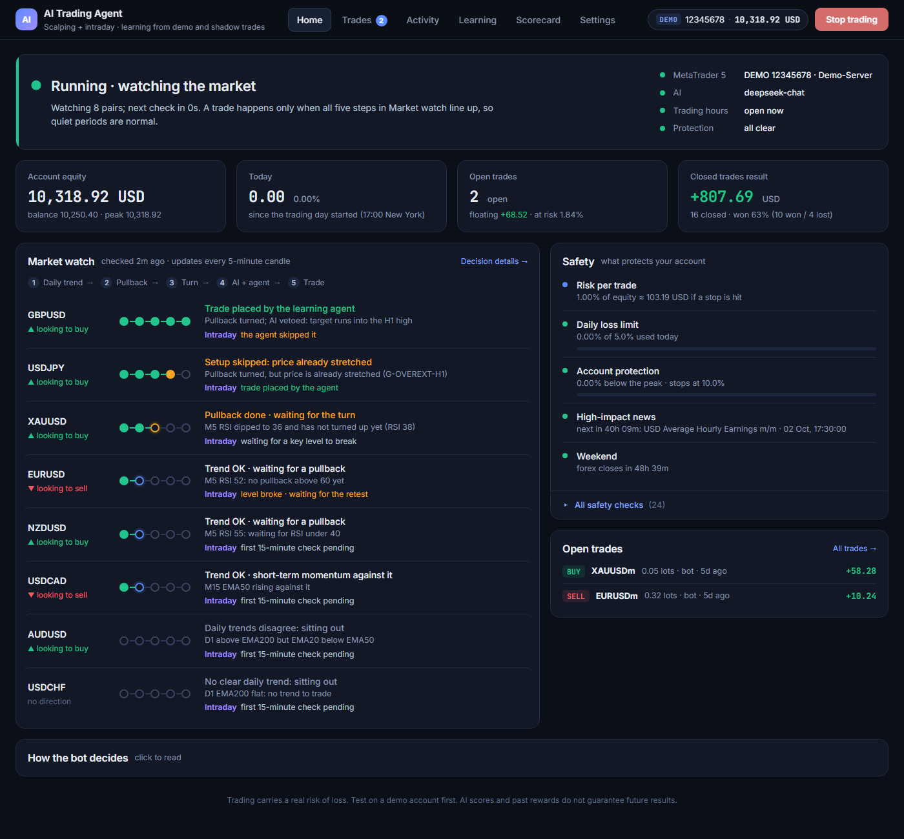
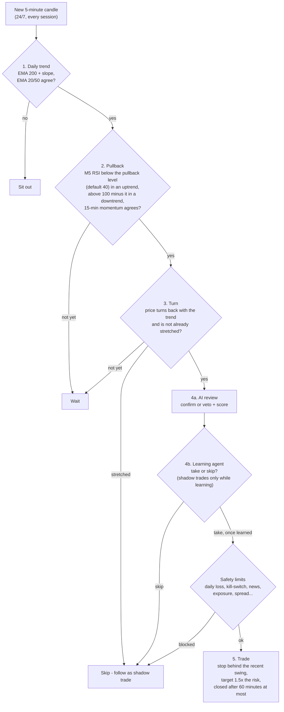
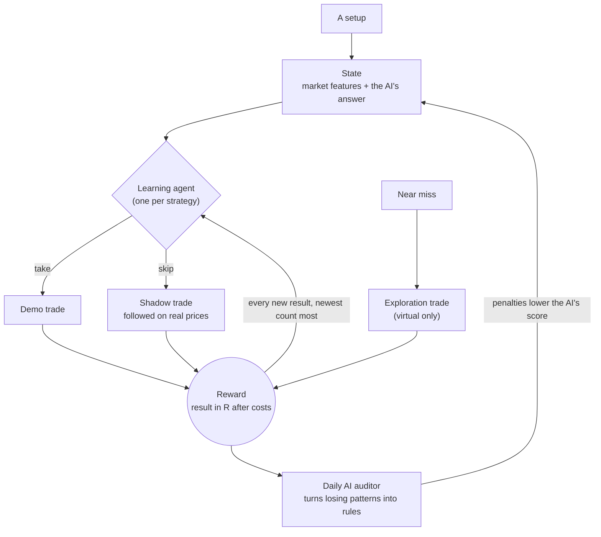
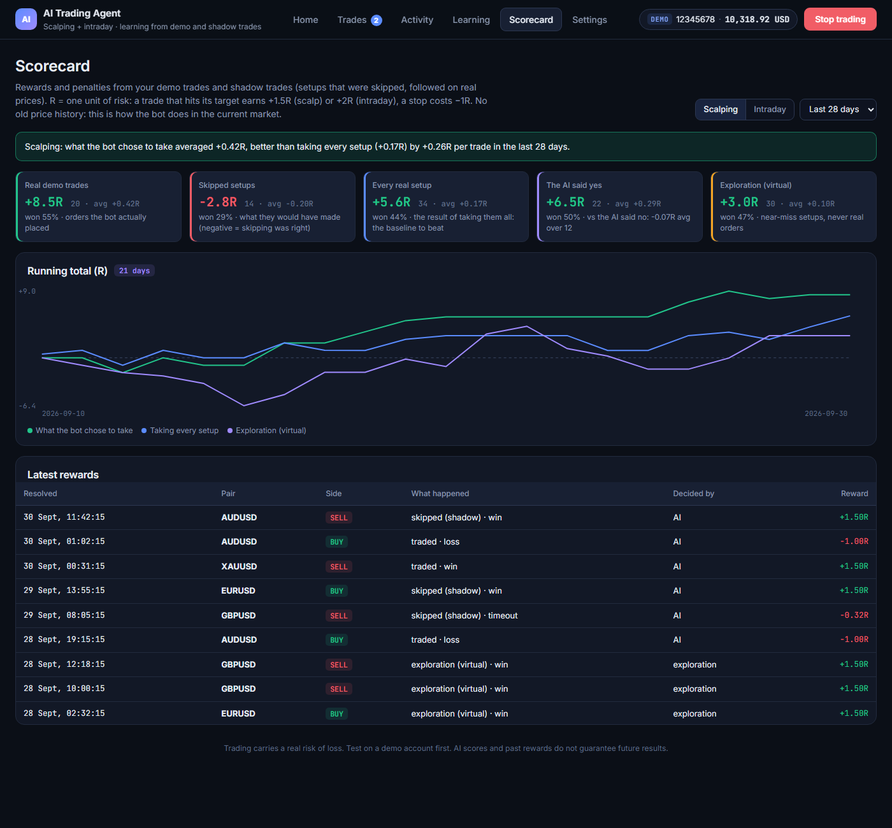
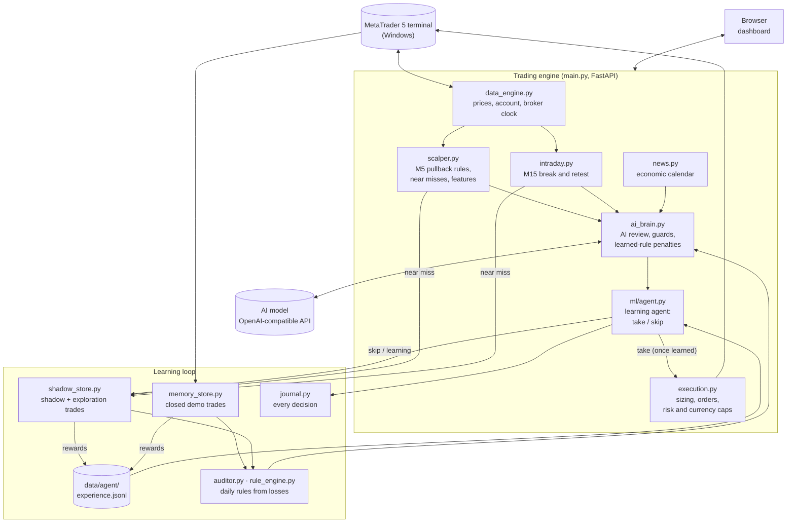
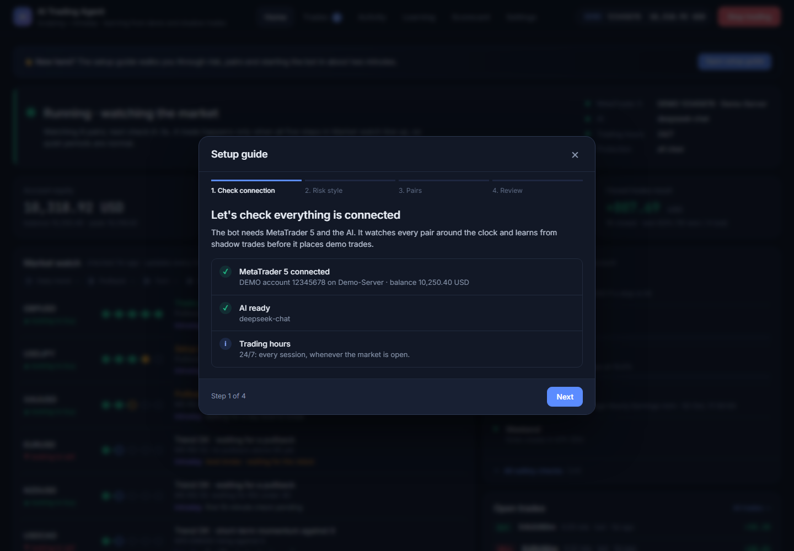
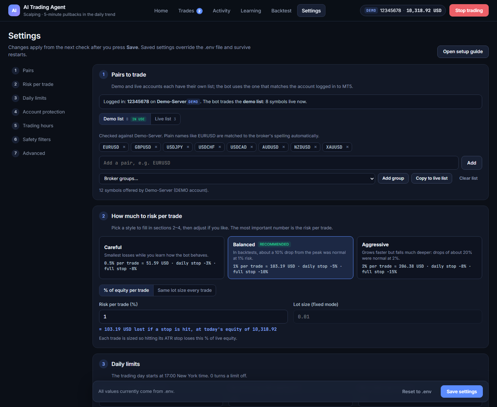
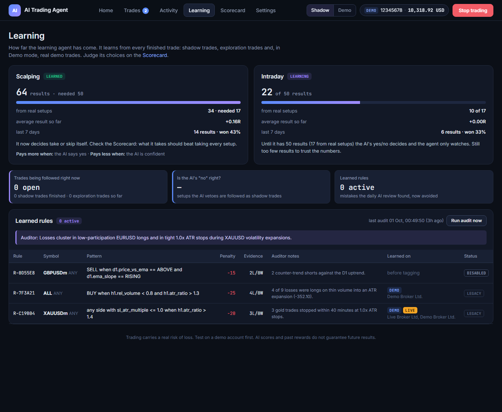
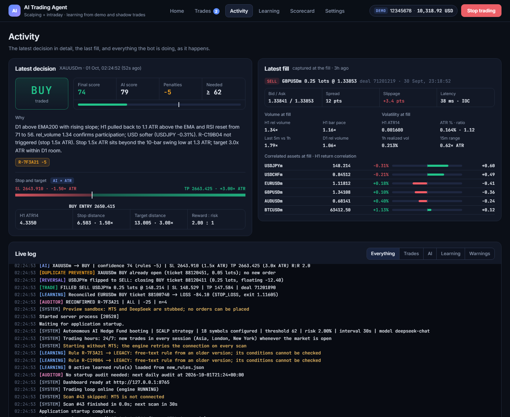
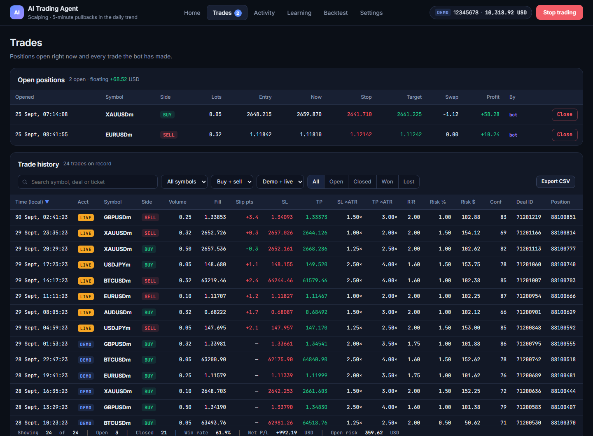

# AI Trading Agent for MetaTrader 5

An autonomous forex and gold trading agent for **MetaTrader 5** that learns from the live market.

- Two rules strategies, **scalping** and **intraday**, look for setups **24/7** on 26 pairs.
- An **AI model** reviews every setup.
- A **reinforcement-learning agent** decides take or skip from the **rewards and penalties** those setups earn.
- It learns on *shadow trades* first (setups followed on real prices without an order) and places demo trades
  only once it has learned.
- Strict, code-enforced risk limits protect the account, and a web dashboard shows everything.




> [!WARNING]
> **This is a research project, not a money machine.** The agent starts from zero and needs weeks of demo
> trading before its choices mean anything. Run it on a **demo account**. Trading carries a real risk of
> loss, and nothing here is financial advice.

---

## Contents

- [Features](#features)
- [How a trade is decided](#how-a-trade-is-decided)
- [Sessions and pairs](#sessions-and-pairs)
- [How it learns](#how-it-learns)
- [How it protects the account](#how-it-protects-the-account)
- [Architecture](#architecture)
- [The dashboard](#the-dashboard)
- [Getting started](#getting-started)
- [Configuration](#configuration)
- [Keeping it running](#keeping-it-running)
- [Project structure](#project-structure)
- [Tests](#tests)
- [Security notes](#security-notes)

---

## Features

| | |
|---|---|
| **Markets** | Up to 120 pairs per list: majors, crosses, exotics and metals. The example list has 26 (USD majors, gold, 18 crosses); you can add every pair your broker actively quotes |
| **Strategies** | *Scalping*: 5-minute pullbacks in the direction of the daily trend. *Intraday*: 15-minute break and retest of yesterday's high/low and the Asian range. Both run at the same time, independently |
| **Hours** | 24/7: every session (Sydney, Tokyo, London, New York) whenever the market is open |
| **AI review** | Any OpenAI-compatible chat model (DeepSeek, NVIDIA NIM and others) reviews each setup with the wider market picture |
| **Learning agent** | One reinforcement-learning agent per strategy learns take or skip from rewards in R: shadow trades, exploration trades and demo trades. No historical price data |
| **Risk** | % of equity sizing, daily loss limit, drawdown kill-switch, per-currency exposure caps, news, spread and weekend guards |
| **Dashboard** | Live market watch, a rewards scorecard, trade history, learning status, settings with presets and a setup guide |

---

## How a trade is decided

### Scalping (every closed 5-minute candle)



Most of the time a pair stops at step 1 or 2, so **quiet periods are normal**. The dashboard's *Market watch*
shows where each pair is in this flow and what it is waiting for.

### Intraday (every closed 15-minute candle)

1. **Levels:** yesterday's high and low, and the high and low of the Asian session.
2. **Break:** a 15-minute candle closes through a level. Yesterday's levels count at any hour; the Asian range
   only after the London open, once it is complete.
3. **Retest:** price comes back to the level within 8 candles. A close more than 0.25 ATR back through the
   level means the break failed.
4. **Entry:** a candle closes back in the break direction. Stop behind the retest swing, target 2× the risk,
   closed after 6 hours at most.
5. Then the same path as a scalp: AI review, learning agent, safety limits.

### Two strategies, independently

- Each strategy holds at most **one trade per pair**.
- A scalp can be long while an intraday trade on the same pair is short. This needs a *hedging* MT5 account
  (the usual kind for retail and demo); on a netting account the opposite trade is refused.
- Each strategy has its own position limit and per-currency risk cap. The daily loss limit and the
  kill-switch cover both together.
- Orders are tagged `-S` / `-I`.

---

## Sessions and pairs

New setups are looked for **24/7** (`TRADE_ALL_HOURS=true`). Forex closes from Friday 17:00 to Sunday 17:00
New York; with no new candles, nothing happens then.

| Session (UTC, roughly) | Most active pairs in the default list |
|---|---|
| Sydney + Tokyo (22:00–08:00) | USDJPY, AUDUSD, NZDUSD, EURJPY, GBPJPY, AUDJPY, CADJPY, CHFJPY, AUDNZD, AUDCAD, AUDCHF |
| London (07:00–16:00) | EURUSD, GBPUSD, USDCHF, XAUUSD, EURGBP, EURCHF, GBPCHF, EURAUD, GBPAUD, EURCAD, GBPCAD, EURNZD, GBPNZD |
| New York (12:00–21:00) | EURUSD, GBPUSD, USDCAD, USDCHF, XAUUSD, CADCHF |

Every pair is watched in every session; the table only shows where each one usually moves most. The
dashboard's Market watch has one tab per session (Sydney, Tokyo, London, New York) listing that session's pairs;
open sessions have a green dot, and the first open one is shown by default.

- **Thin hours and the daily rollover** (17:00 New York) are handled by the spread check: no trade when the
  spread is more than 25% of the stop.
- **The agent sees the hour of every setup**, so it learns which hours pay.
- **Pair names:** plain names match the broker's spelling automatically (EURUSD → EURUSDm, EURUSD.r).
- **Adding every active pair is fine for learning.** Each AI review only sees the pairs related to the one
  it is judging (sharing a currency, plus the USD majors), so prompts stay short. The USD-direction read uses
  only the major USD pairs. Pairs whose spread is too wide are skipped by the spread check, for real setups
  and exploration trades alike, so they cost a little scan time but produce no misleading rewards.
- **Checking 99 pairs takes about 10 seconds** per 5-minute candle.

---

## How it learns



### Rewards and penalties

- Every setup ends as a reward in R, where R is one unit of risk: the stop distance.
- A target hit earns +1.5 (scalp) or +2 (intraday), a stop costs −1, and a time-stop exit earns whatever it moved.
- Rewards are measured after the spread.

### Where rewards come from

Every setup is followed whatever happens to it:

| What happens to the setup | Paid by |
|---|---|
| Traded | The demo trade |
| Skipped, whatever the reason (AI veto, agent skip, below the score threshold, daily cap, loss cooldown, safety limit) | Its shadow trade, followed on real prices, so the agent also learns whether skipping was right |
| Near miss (the dip stopped a few RSI points short, or 15-minute momentum had not turned yet) | An **exploration trade**: virtual, no AI call, at most one every 20 minutes per pair and side |

### The agent

- It is a *contextual bandit*, the form of reinforcement learning built for take-or-skip decisions with few
  samples.
- It keeps a Bayesian model of the reward, given the market state and the AI's answer, updated after every
  result.
- It decides by *Thompson sampling*: early choices vary, and they settle as the evidence grows.
- Rewards fade with a 30-day half-life, so it follows the current market.

### Phases

| Phase | What happens | Dashboard shows |
|---|---|---|
| Learning | The AI reviews every real setup; every setup is followed as a shadow trade, with no orders | "AI said yes · shadow trade while the agent learns" |
| Learned (50 rewards, 17 from real setups) | The agent takes or skips; takes become demo orders | "Trade placed by the learning agent" / "The learning agent skipped it" |
| Always | Near misses followed as exploration trades | Scorecard → Exploration |

Hard limits (spread too wide for the stop, the safety limits below) can never be overruled.

### Judge it on the Scorecard

The **Scorecard** page answers the only question that matters: does what the bot chose to take do better than
taking every setup? Trust it only after a few hundred rewards.



---

## How it protects the account

Protection is enforced by code. The AI can only make the bot **more** careful, never riskier.

| Protection | What it does | Default |
|---|---|---|
| Risk per trade | Lot size so a stop-loss costs this % of equity | 1% |
| Daily loss limit | No new trades until 17:00 New York after losing this much today; can close the bot's trades | 5% |
| Account protection | Half risk after falling from the equity peak, full stop further down (manual reset) | −5% / −10% |
| Open risk budget | Refuses a trade if every open stop plus the new one could pass the daily limit | on |
| Currency exposure | Caps the combined risk on one currency direction (e.g. long USD), per strategy | 2.5% |
| News guard | No entries 30 min before to 15 min after high-impact news | on |
| Weekend guard | No entries in the last hours before the Friday close; can also close the bot's trades | entry pause on, auto-close off |
| Stretched-price guard | Skips setups far from their average or with extreme RSI | on |
| Loss cooldown | No re-entry in the same direction on a pair after a loss | 120 min |
| Spread and drift checks | Refuses orders when the spread is too wide or price moved while the AI was thinking | on |
| Duplicate and reversal guards | One position per pair per strategy; flips need extra confidence | on |

All limits survive restarts; they are saved to `risk_state.json`.

---

## Architecture



The engine runs on three clocks:

- **Every 5-minute (scalp) and 15-minute (intraday) candle, for every pair:** rules → AI review → learning
  agent → safety limits → order or shadow trade. Every step is written to the decision journal.
- **Every scan (30 s):** open shadow and exploration trades are followed on real M1 prices, closed demo
  trades are reconciled, and every new result goes to the agent.
- **Once a day:** the AI auditor looks for losing patterns and writes rules that can only lower the AI's
  score.

| Data file (git-ignored) | Holds |
|---|---|
| `memory.json` | Every demo/live trade, with its market snapshot and the agent's state |
| `shadow_trades.json` | Skipped setups followed on real prices (also used by the auditor) |
| `data/agent/explore_shadows.json` | Virtual exploration trades |
| `data/agent/experience.jsonl` | One line per reward: the agent's training data |
| `data/journal/*.jsonl` | Every evaluation, one file per day |
| `settings.json` | Settings saved from the dashboard |
| `risk_state.json` | Daily limits and the equity peak |

---

## The dashboard

Open `http://127.0.0.1:8000` once the bot is running.

| Page | What you see |
|---|---|
| **Home** | Running status, today's result, Market watch (every pair's step in the flow, scalp and intraday, with one tab per session: Sydney, Tokyo, London, New York), safety summary, open trades |
| **Trades** | Open positions (with close buttons) and the full trade history with filters, a Strategy column and CSV export |
| **Activity** | The latest decision in detail, the latest fill, and a live log with filters |
| **Learning** | The learning agent per strategy (progress, what moves its rewards), learned rules, the AI-veto check, shadow trades |
| **Scorecard** | Rewards and penalties per strategy and period, a running-total chart and the latest results |
| **Settings** | Pairs, risk presets, daily limits, account protection, strategies and 24/7 trading, safety filters, the learning agent |

**First-run setup guide:** connection check → risk style → pairs → review and start.



**Settings**, with one-click risk styles that show the money at risk for your balance:



<details>
<summary><b>More screenshots</b> (Learning, Activity, Trades)</summary>





</details>

*Screenshots use demo data.*

---

## Getting started

### Requirements

- **Windows**: the MetaTrader 5 Python package only works on Windows.
- **MetaTrader 5**, installed and logged in to your broker account. Use a **demo** account first.
- **Python 3.12 or 3.13**.
- An **API key** for an OpenAI-compatible chat model (for example DeepSeek, or NVIDIA's free endpoints).

### Install

```powershell
git clone <your-repo-url>
cd <repo-folder>
py -3.13 -m venv .venv
.venv\Scripts\python.exe -m pip install -r requirements.txt
copy .env.example .env
```

Edit `.env` and fill in at least:

```ini
DEEPSEEK_API_KEY=your_api_key
DEEPSEEK_API_BASE=https://api.deepseek.com
DEEPSEEK_MODEL=deepseek-chat
MT5_LOGIN=your_account_number
MT5_PASSWORD=your_password
MT5_SERVER=YourBroker-Demo
```

In MetaTrader 5, enable **Tools → Options → Expert Advisors → Allow algorithmic trading**.

### Run

```powershell
start_background.bat      # starts the bot in the background (restarts itself if it crashes)
stop_background.bat       # stops it
```

Then open **http://127.0.0.1:8000**. The setup guide opens on the first visit. Press **Start trading**
when you are ready. The output goes to `server.log`.

---

## Configuration

Everything lives in `.env`; [`.env.example`](.env.example) has every option with an explanation. Most options
can also be changed live on the **Settings** page. Those choices are saved in `settings.json` and override
`.env` until you press *Reset to .env*.

| Setting | Meaning | Default |
|---|---|---|
| `SCALP_ENABLED` / `INTRADAY_ENABLED` | Which strategies run (both can be on) | `true` / `false` |
| `TRADE_ALL_HOURS` | New trades 24/7, in every session | `true` |
| `SCALP_SESSION_START_LONDON` / `SCALP_SESSION_END_NEW_YORK` | Trading window when 24/7 is off (London / New York hour) | `7` / `16` |
| `SYMBOLS_DEMO` / `SYMBOLS_LIVE` | Pairs for demo and live accounts | 26 pairs / 8 majors + gold |
| `DEFAULT_RISK_PERCENT` | Risk per trade, % of equity | `1.0` |
| `INTRADAY_RISK_PERCENT` | Risk per intraday trade (0 = same as scalping) | `0` |
| `MAX_DAILY_LOSS_PERCENT` | Daily loss limit | `5.0` |
| `MAX_TOTAL_DRAWDOWN_PERCENT` / `DRAWDOWN_THROTTLE_PERCENT` | Kill-switch / half-risk level from the equity peak | `10` / `5` |
| `SCALP_RSI_PULLBACK` | Scalp pullback: M5 RSI below this (above 100 − it for sells); higher = more setups | `40` |
| `SCALP_TIME_STOP_MINUTES` | Close a scalp after this long | `60` |
| `INTRADAY_REWARD_RISK` / `INTRADAY_TIME_STOP_MINUTES` | Intraday target (× risk) / maximum holding time | `2.0` / `360` |
| `CONFIDENCE_THRESHOLD` | AI score counted as a "yes" | `65` |
| `AGENT_ENABLED` | The learning agent decides once learned (off = the AI decides) | `true` |
| `AGENT_SHADOW_UNTIL_LEARNED` | Shadow trades only until the agent has learned; demo orders after | `true` |
| `AGENT_MIN_REWARDS` | Rewards per strategy before it has learned (a third from real setups) | `50` |
| `AGENT_EXPLORE` | Virtual exploration trades on near-miss setups | `true` |
| `AGENT_HALF_LIFE_DAYS` | How fast old rewards fade | `30` |
| `NEWS_GUARD` | Avoid high-impact news | `true` |
| `AUTO_START_ENGINE` | Start trading as soon as the server starts (needed for unattended 24/7) | `false` |
| `HOST` / `PORT` | Dashboard address | `127.0.0.1` / `8000` |

---

## Keeping it running

Trading 24/7 needs a **Windows machine that stays on** with MetaTrader 5 running. Serverless hosts cannot run
it: there is no MT5 terminal, no always-on process and no persistent files.

- **Windows VPS or your own PC:**
  - Install MT5 with auto-login and set `AUTO_START_ENGINE=true`.
  - Add `start_background.bat` to Task Scheduler "at log on", and disable sleep.
  - Risk limits, the equity peak and everything the agent has learned survive restarts.
- **Linux server:** run a Windows virtual machine. MT5 under Wine is not reliable enough for real money.
- Run **only one copy per MT5 account**, or it may trade twice.

---

## Project structure

```
├── main.py              # FastAPI app: trading loop, risk watchdog, learning cycle, API, dashboard
├── scalper.py           # scalping rules (trend, pullback, turn, guards), near misses, market features
├── intraday.py          # intraday rules (M15 break and retest of key levels), near misses
├── ai_brain.py          # AI prompts, review, protective guards, learned-rule penalties
├── ml/agent.py          # learning agent: state, rewards, Thompson-sampling take/skip, scorecard
├── execution.py         # position sizing, orders, open-risk and per-strategy currency caps
├── data_engine.py       # MT5 connection, prices, account, broker clock, hedging check
├── shadow_store.py      # shadow and exploration trades followed on real prices
├── memory_store.py      # trade memory (memory.json) and reconciliation
├── journal.py           # decision journal (every evaluation, JSONL per day)
├── auditor.py           # daily AI auditor that writes rules from losing trades
├── rule_engine.py       # checks learned rules in code
├── calibration.py       # confidence-threshold calibration
├── news.py              # high-impact economic calendar
├── sessions.py          # Sydney/Tokyo/London/New York hours and each pair's sessions (dashboard tabs)
├── settings_store.py    # settings saved from the dashboard
├── config.py            # all settings, read from .env
├── templates/index.html # the dashboard (single page)
├── tests/               # 15 test suites, run with run_tests.py
├── docs/                # IMPROVEMENT_PLAN.md (design decisions and their history) and README images
├── start_background.bat / stop_background.bat / run_server.bat
├── requirements.txt
└── .env.example         # every setting with an explanation
```

---

## Tests

```powershell
.venv\Scripts\python.exe run_tests.py            # all 15 suites
.venv\Scripts\python.exe run_tests.py agent      # only suites matching a name
```

The tests use stubbed MT5 and AI connections, fixed settings and temporary folders, so they never place
orders, never depend on your `.env` and never touch your real data.

---

## Security notes

- **Never commit `.env`.** It holds your API key and MT5 password; it is git-ignored, like every runtime file
  listed above.
- The dashboard has **no login** and can place and close trades. Keep `HOST=127.0.0.1`. To reach it from
  another device, use Remote Desktop or a private network such as Tailscale, not port forwarding.
- Start on a **demo account**. Move to live only after long, positive demo results on the Scorecard.
